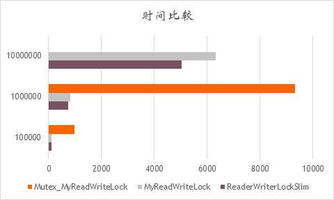

# NetLearing
# 读写锁的实现与应用

## 读写锁的实现

### 使用的原语

·        Interlocked互锁函数族

·        AutoRestEvent，ManualResetEvent事件

·        Mutex互斥锁（用来测试对比）

### 实现思路

\1.     **读写锁本身临界区的保护**：使用互锁函数族（Interlocked）实现的自旋锁（SpinLock）对读写锁本身临界区的保护。除此之外，使用互斥锁（Mutex）实现临界区保护做性能测试对比。

\2.     **读者/****写者等待与唤醒**：使用事件（AutoRestEvent，ManualResetEvent）让读者/写者等待，避免忙等。事件触发来唤醒等待中的写者和读者

### 调度策略

\1.     **读者获取锁**：读者到来时，判断是否已有写者或等待中的写者，如果没有写者，则直接进入读模式，读计数+1。 如果有，则进入睡眠模式，等待所有写者完成工作，以此避免写饥饿。

\2.     **写者获取锁**：写者到来时,关闭读事件，后续读者均无法获取读锁，避免**写饥饿**。之后判断是否已有读者或写者正在工作，如果有，则写等待计数+1，写者进入睡眠模式。如果没有，则获取写锁，写者工作。

\3.     **读者释放锁**：释放锁时，判断自己是否是最后一个读者，如果还有其他读者正在读，则读计数-1，直接退出。如果是最后一位读者，就判断是否有等待中写者，有则触发写事件唤醒一位写者（AutoResetEvent）。

\4.     **写者释放锁**：写者释放锁时，判断是否有写者等待，如果有，触发写事件唤醒一位写者。如果没有等待的写者，就开启读事件（ManualResetEvent），唤醒等待的读者。

\5.     **注意**：事件触发仅仅用于唤醒等待的线程，以此避免忙等。但并不代表被唤醒后，线程一定能获取读写锁。线程被唤醒后，需要继续根据上述调度策略竞争读写锁。

| **计数\时间ms** | **ReaderWriterLockSlim** | **MyReadWriteLock** | **Mutex_MyReadWriteLock** |
| --------------- | ------------------------ | ------------------- | ------------------------- |
| **100000**      | 101                      | 115                 | 980                       |
| **1000000**     | 743                      | 824                 | 9328                      |
| **10000000**    | 5037                     | 6316                | -                         |

## 优缺点与进一步优化

\1.     不可**重入**

重入是指获取读写锁的线程重复获取读写锁，常见在递归程序。在本读写锁实现中，读者写者不可重复获取读写锁，不然会导致死锁

\2.     不支持**锁升级**和**锁降级**

锁升级指的是线程获取到了读锁，在没有释放读锁的前提下，又获取写锁。锁降级指的是线程获取到了写锁，在没有释放写锁的情况下，又获取读锁。本读锁实现不支持锁升级锁降级。写者必须释放写锁才能获取读锁，读者也必须释放读锁才能获取写锁，不然会导致死锁。

\3.     **自旋锁**实现临界区保护

由于临界区操作代码短执行快，读写锁临界区冲突可能性较小，采用自旋锁实现能有效提升性能。相较于Mutex可以减少用户态到内核态的开销，以及线程上下文切换的浪费。此外，本自旋锁在自旋达到最大次数后，会主动放弃线程执行，避免忙等。

\4.     进一步优化：

参考C# ReaderWriterLockSlim 源码实现，可以发现，其读者写者冲突时，并不是立即让线程睡眠，而是先自旋一定次数，  每次自旋中持续竞争读写锁。直到达到最大自旋次数还未获取读写锁，才让线程睡眠等待唤醒事件。  因此可以从这个方面进一步去优化读写锁。